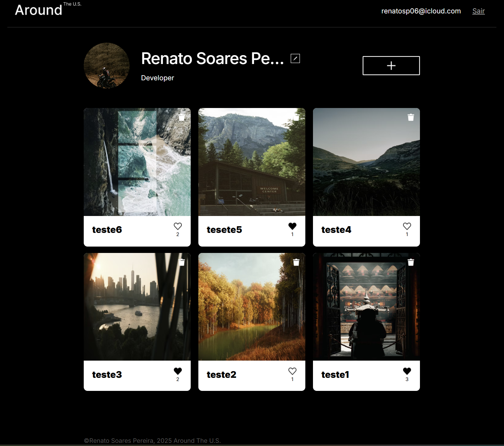

# Around The U.S. - Authentication

Este projeto estende o aplicativo React "Around The U.S." com um sistema completo de autenticação. Implementa registro, login, rotas protegidas e integração com back-end, permitindo que usuários acessem conteúdo exclusivo após autenticação.

## Acesso ao Servidor

O aplicativo está disponível em: [https://seu-dominio.com](https://seu-dominio.com)

A API pode ser acessada em: [https://seu-dominio.com/api](https://seu-dominio.com/api)

## Funcionalidades

- Registro de novos usuários através do endpoint /signup
- Autenticação de usuários via endpoint /signin
- Rotas protegidas que exigem autenticação
- Redirecionamento automático para login quando não autenticado
- Armazenamento de token JWT no localStorage
- Componente InfoTooltip para feedback de operações
- Cabeçalho dinâmico que muda conforme estado de autenticação
- Validação de token via endpoint /users/me

## Tecnologias Utilizadas

- React.js (v18.2.0)
- React Router (v6.16.0)
- CSS3 com abordagem mobile-first
- Fetch API para comunicação com back-end
- JWT (JSON Web Tokens) para autenticação
- LocalStorage para persistência de sessão
- Context API para gerenciamento de estado

## Configuração do Projeto

- Pré-requisitos:

-- Node.js (v18.x ou superior)
-- npm (v9.x ou superior)

## Instalação

1. Clonar repositório:
   ```git clone https://github.com/seu-usuario web_project_around_auth.git```
2. Entrar no diretório:
   ```cd web_project_around_auth```
3. Instalar dependências:
```npm install ```
4. Iniciar servidor de desenvolvimento:
  ```npm start```

## Imagens e layout :

### Página de Login


### Página do Perfil



Desenvolvido por Renato Soares Pereira.
